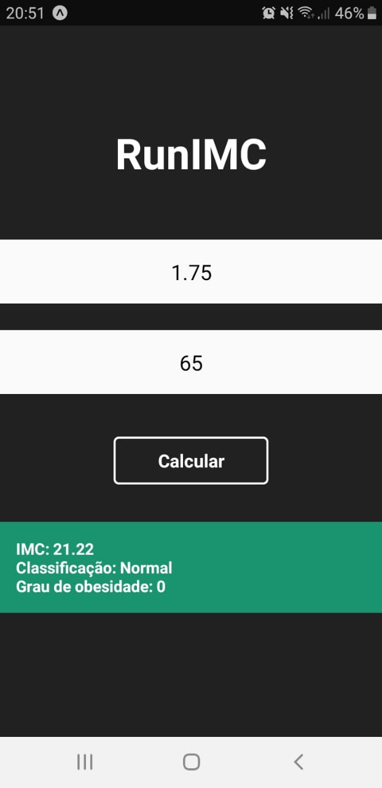

# RunIMC

Passo a passo de como criar a aplicação apresentada no minicurso introdutório ao React Native

### Criando a aplicação co Expo

```shell
$ expo init 
```

### Executando a aplicação inicial
```shell
$ cd runIMC
$ yarn start
```

### Editando a tela da aplicação

Edite o conteúdo da tela inicial da aplicação, mantendo a seguinte estrutura apenas.

```javascript
import React from 'react';
import { StyleSheet, View, Text } from 'react-native';

const App = () => {
    return (
         <View style={styles.container}>
            <Text>RunIMC</Text>
         </View>

    )
}

const styles = StyleSheet.create({
  container: {
    flex: 1,
    justifyContent: 'center',
    alignItems: 'center',
  }
});

export default App
```
### Criando um componente

Em seguida, vamos criar um componente Button. Para isso, crie o arquivo **src/componentes/Button/index.js** com o seguinte conteúdo.

```javascript
import React from 'react';
import { TouchableOpacity, StyleSheet, Text, View } from 'react-native';

const Button = (props) => {
    return (
        <>
            <TouchableOpacity style={styles.button} onPress={props.function}>
                <Text style={styles.textButton}>{props.text}</Text>
            </TouchableOpacity>
        </>
    )
}

const styles = StyleSheet.create({
    button:{
        borderWidth:2,
        borderColor: '#FFF',
        width: 146,
        height: 45,
        alignItems: 'center',
        justifyContent: 'center',
        borderRadius: 5,
        marginTop: 40,
    },

    textButton:{
        color: '#FFF',
        fontWeight: 'bold',
        fontSize: 17
    }
})

export default Button;
```

O que fizemos foi criar um botão utilizando o componente **TouchableOpacity** do React Native, onde o botão irá possuir as propriedades **function** e **text** que são obtidas através do ***props***, que são os atributos que o componente tem ou terá.

### Importando o Button

Para importar o componente para a tela da aplicação, adicione a seguinte linha no arquivo **App.js**:

```javascript
import Button from '.src/components/Button'
```

Para testar o componente criado, vamos criar uma função simples no arquivo **App.js** para exibir algum texto quando o botão for clicado.

```javascript
function calcularIMC(){
    alert("Calculando IMC...")
}
```

Em seguida, crie um botão utilizando o componente criado anteriormente. Para isso, adicione a linha no arquivo **App.js**:

```javascript
    <Button text="Salvar" function={calcularIMC} />  
```
***text*** e ***function*** são os atributos que serão utilizados na criação do botão, através da variável ***props***. 

Com isso, já podemos ver o botão na tela que ao ser clicado,a função ***calcularIMC()*** será executada e o ***alert*** será exibido.


### Criando os componentes da aplicação

Para ler as informações de peso e altura do usuário, vamos adicionar duas instâncias do componente ***TextInput*** ao arquivo **App.js**.

O arquivo deve ter o seguinte conteúdo depois dessa alteração:

```javascript
import React from 'react';
import { StyleSheet, View, Text, TextInput } from 'react-native';

import Button from '.src/components/Button'

const App = () => {

    function calcularIMC(){
        alert("Calculando IMC...")
    }

    return (
         <View style={styles.container}>
            <Text>RunIMC</Text>

            <TextInput
                type="text"
                placeholder="Altura"
                keyboardType="numeric"
            />

            <TextInput
                type="text"
                placeholder="Peso"
                keyboardType="numeric"
            />
            <Button text='Calcular' function={calculateIMC} />
            
        </View>
    )
}

const styles = StyleSheet.create({
  container: {
    flex: 1,
    justifyContent: 'center',
    alignItems: 'center',
  }
});

export default App
```

Agora temos dois inputs para ler as informações do usuário. Como vamos obter apenas dados numéricos, definimos que o atributo **keyboardType** dos inputs será numérico, ou seja, quando o usuário clicar em um dos inputs, o teclado que será mostrado exibirá apenas números.

### Armazenando os dados inseridos nos inputs com useState

Para obter e armazenar os dados obtidos através dos inputs, vamos usar o ***hook*** **useState()**. 

Um ***hock*** é uma função especial que te permite utilizar recursos do React. Por exemplo, o **useState()** é um ***hook*** que te permite adicionar o ***state*** do React a componente de função. 

O ***state*** de um componente é similar as ***props***, mas é privado e totalmente controlado pelo componente.

Para utilizar o ***useState*** na nossa aplicação, vamos importá-lo no arquivo **App.js** da seguinte forma:

```javascript
import React, { useState } from 'react';
```

Agora, vamos criar as constantes que serão manipuladas através do **useState**:

```javascript
   /**
   * Dados a serem lidos do usuário
   */
  const [altura, setAltura] = useState('');
  const [peso, setPeso] = useState('')

  /**
   * Dados a serem exibidos
   */
  const [imc, setImc ] = useState(0)
  const [classe, setClasse] = useState('')
  const [grau, setGrau] = useState(0)
  const [warning, setWarning] = useState(0)
```

Acima, estão sendo criadas 5 constantes e suas respectivas funções de alteração. 

- altura e peso: valores que serão lidos nos inputs
- imc: valor que será calculado através da altura e peso informados
- classe e grau: indicam a classe e o grau de obesidade obtidos através do imc calculado para os dados lidos
warning: atributo utilizado para modificar a estilização do componente **Text** que irá exibir os dados sobre o imc calculado.

Dentro dos parênteses de cada **useState()** está o valor inicial dessas constantes.

Com os states criados, vamos referênciá-los nos inputs para que o valor inserido nos mesmos seja atribuido a sua respectiva constante. Com essa alteração, o conteúdo do arquivo **App.js** deve ficar assim:

```javascript
import React, { useState } from 'react';
import { StyleSheet, View, Text, TextInput } from 'react-native';

import Button from '.src/components/Button'

const App = () => {
    /**
    * Dados a serem lidos do usuário
    */
    const [altura, setAltura] = useState('');
    const [peso, setPeso] = useState('')

    /**
    * Dados a serem exibidos
    */
    const [imc, setImc ] = useState(0)
    const [classe, setClasse] = useState('')
    const [grau, setGrau] = useState(0)
    const [warning, setWarning] = useState(0)

    function calcularIMC(){
        alert("Calculando IMC...")
    }

    return (
         <View style={styles.container}>
        
            <Text>RunIMC</Text>

            <TextInput
                type="text"
                placeholder="Altura"
                keyboardType="numeric"
                value={altura}
                onChangeText={setAltura}
            />

            <TextInput
                type="text"
                placeholder="Peso"
                keyboardType="numeric"
                value={peso}
                onChangeText={setPeso}
            />
            <Button text='Calcular' function={calculateIMC}/>
      </View>

    )
}

const styles = StyleSheet.create({
  container: {
    flex: 1,
    justifyContent: 'center',
    alignItems: 'center',
  }
});

export default App
```

### Exibindo as informações calculadas

Para exibir as informações calculadas, vamos utilizar o componente ***Text*** do React Native:

```javascript
<Text style={(warning == 0) ? styles.imcNormal : ((warning == 1) ? styles.imcSaudavel : styles.imcRuim)}>
          IMC: {imc.toFixed(2)}{"\n"}
          Classificação: {classe}{"\n"}
          Grau de obesidade: {grau}
</Text>
```

Como pode ser visto, a estilização desse componente vai variar de acordo com a constante ***warning***, que inicialmente terá o valor 0, que logo atribui o estilo **imcNormal** ao componente.

Para ter acesso ao valores do states, é necessário utilizar {nome_do_state}. A função **toFixed(2)** faz com que sejam utilizadas apenas duas casas decimais do imc calculado, enquanto o **{"\n"}** representa uma quebra de linha em um componente **<Text>**.

Adicione os estilos a seguir para os componentes e referencie cada um no seu respectivo componente:


Com essa alteração, o conteúdo do arquivo **App.js** deverá ter o seguinte conteúdo:

```javascript
inputs: {
    backgroundColor: '#fafafa',
    marginTop: 25,
    width: '100%',
    height: 60,
    textAlign: 'center',
    fontSize: 20
  },

  title: {
    fontSize: 40,
    color: '#FFF',
    marginBottom: 30,
    fontWeight: 'bold'
  },

  imcNormal: {
    marginTop: 35,
    backgroundColor: '#FFF',
    width: "100%",
    color:"black",
    justifyContent: 'center',
    alignItems: 'center',
    padding: 15,
    fontSize: 15,
    fontWeight: 'bold'
  },

  imcSaudavel: {
    marginTop: 35,
    backgroundColor: '#1A936F',
    width: "100%",
    color:"#FFF",
    justifyContent: 'center',
    alignItems: 'center',
    padding: 15,
    fontSize: 15,
    fontWeight: 'bold'
  },

  imcRuim: {
    marginTop: 35,
    backgroundColor: '#E71D36',
    width: "100%",
    color:"#FFF",
    justifyContent: 'center',
    alignItems: 'center',
    padding: 15,
    fontSize: 15,
    fontWeight: 'bold'
  }
```

```javascript
import React, { useState } from 'react';
import { StyleSheet, View, Text, TextInput } from 'react-native';

import Button from '.src/components/Button'

const App = () => {
    /**
    * Dados a serem lidos do usuário
    */
    const [altura, setAltura] = useState('');
    const [peso, setPeso] = useState('')

    /**
    * Dados a serem exibidos
    */
    const [imc, setImc ] = useState(0)
    const [classe, setClasse] = useState('')
    const [grau, setGrau] = useState(0)
    const [warning, setWarning] = useState(0)

    function calcularIMC(){
        alert("Calculando IMC...")
    }

    return (
         <View style={styles.container}>
        
            <Text style={styles.title}>RunIMC</Text>

            <TextInput
                style={styles.inputs}
                type="text"
                placeholder="Altura"
                keyboardType="numeric"
                value={altura}
                onChangeText={setAltura}
            />

            <TextInput
                style={styles.inputs}
                type="text"
                placeholder="Peso"
                keyboardType="numeric"
                value={peso}
                onChangeText={setPeso}
            />
            <Button text='Calcular' function={calculateIMC}/>

            <Text style={(warning == 0) ? styles.imcNormal : ((warning == 1) ? styles.imcSaudavel : styles.imcRuim)}>
                IMC: {imc.toFixed(2)}{"\n"}
                Classificação: {classe}{"\n"}
                Grau de obesidade: {grau}
            </Text>
      </View>

    )
}

const styles = StyleSheet.create({
  container: {
    flex: 1,
    justifyContent: 'center',
    alignItems: 'center',
  },

  inputs: {
    backgroundColor: '#fafafa',
    marginTop: 25,
    width: '100%',
    height: 60,
    textAlign: 'center',
    fontSize: 20
  },

  title: {
    fontSize: 40,
    color: '#FFF',
    marginBottom: 30,
    fontWeight: 'bold'
  },

  imcNormal: {
    marginTop: 35,
    backgroundColor: '#FFF',
    width: "100%",
    color:"black",
    justifyContent: 'center',
    alignItems: 'center',
    padding: 15,
    fontSize: 15,
    fontWeight: 'bold'
  },

  imcSaudavel: {
    marginTop: 35,
    backgroundColor: '#1A936F',
    width: "100%",
    color:"#FFF",
    justifyContent: 'center',
    alignItems: 'center',
    padding: 15,
    fontSize: 15,
    fontWeight: 'bold'
  },

  imcRuim: {
    marginTop: 35,
    backgroundColor: '#E71D36',
    width: "100%",
    color:"#FFF",
    justifyContent: 'center',
    alignItems: 'center',
    padding: 15,
    fontSize: 15,
    fontWeight: 'bold'
  }
});

export default App
```

### Calculando e verificando o IMC

Altere o código da função ***calcularIMC()*** para:

```javascript
    function calcularIMC(){

    /**
     * Caso o usuário deixe um dos campos em branco, não será calculado o IMC e além disso, o Text que exibe as informações terá 
     * sua estilização alterada para seu estilo inicial 
     */
    if (peso == '' || altura == '') {
      verificarIMC(0)
      return
    }

    /**
     * Calculando o imc
     */
    imcValue=parseFloat(peso)/(parseFloat(altura) * parseFloat(altura))

    /**
     * Atribuindo o valor calculado a constante imc
     */
    setImc(imcValue)

    /**
     * Executando a verificação do IMC calculado
     */
    verificarIMC(imcValue)
    }
```

Além disso, crie a função ***verificarIMC()*** com as seguintes instruções:

```javascript
    const verificarIMC = (value) => {
        if(value == 0) {
            setWarning(0)
            setClasse('')
            setImc(0)
            setGrau(0)
            return
        }

        if (value < 18.5){
            setWarning(2)
            setClasse("Magreza")
            setGrau(0)
            return 
        }

        if (value < 24.9){
            setWarning(1)
            setClasse("Normal")
            setGrau(0)
            return 
        }

        if (value < 29.9){
            setWarning(2)
            setClasse("Sobrepeso")
            setGrau(1)
            return 
        }

        if (value < 39.9){
            setWarning(2)
            setClasse("Obesidade")
            setGrau(2)
            return 
        }

        if (value > 40){
            setWarning(2)
            setClasse("Obesidade Grave")
            setGrau(3)
            return 
        }
  }
```

Com isso, o objetivo da aplicação foi alcançado, com o cálculo do IMC e as informações obtidas através dele.

### Ajustes finos

#### Ocultando o Keyboard quando o botão for clicado

Importe o componente **Keyboard** do React Native:

```javascript
    import { StyleSheet, View, Text, TextInput, Keyboard } from 'react-native';
```

Depois, insira a linha a seguir no início do código da função ***calcularIMC()***:

```javascript
    Keyboard.dismiss()
```

#### StatusBar transparente e da cor do aplicativo

Importe o componente **StatusBar** do React Native:

```javascript
    import { StyleSheet, View, Text, TextInput, Keyboard, StatusBar } from 'react-native';
```

Depois, crie uma instância do componente antes da View principal da aplicação. Porém, a função return de um componente pode retornar apenas um componente, por isso vamos envolver o componente **StatusBar** criado e a View principal da aplicação em um ***fragment*** ( <> </>) da seguinte forma:

```javascript
return (
    <>
        /**
         * Criando uma StatusBar transparente e com a mesma cor de fundo definida para a View principal (container)
         */
        <StatusBar translucent backgroundColor={styles.container.backgroundColor}>

        <View style={styles.container}>
            ...
        </View>
    </>
)
```

Por fim, essa será a aparência da aplicação caso todos os passos anteriores tenham sido realizados:
<p align="center">

</p>


